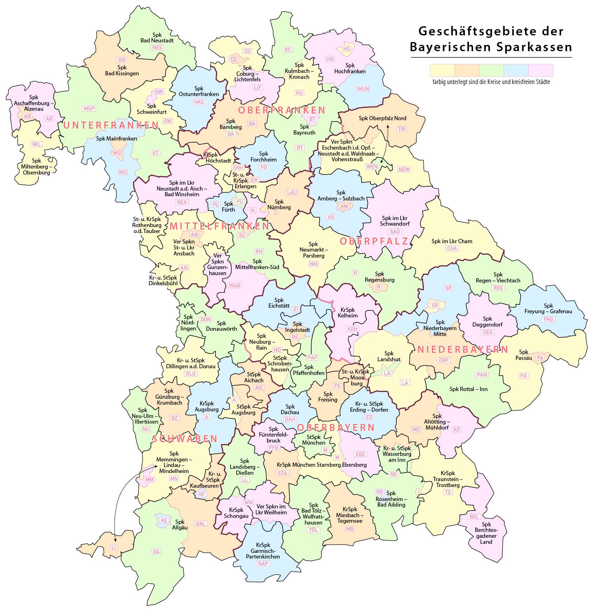

```{r setting_chunk_options, include=FALSE}
knitr::opts_chunk$set(fig.height=3, fig.width = 2.4, fig.align = "center", fig.path='graphs/',
                      include = FALSE, warning=FALSE, message=FALSE, cache=TRUE)
# Supressed output for any code chunk in the document, so all graphs, tables,
# etc which need to have the outputs shown should use include = TRUE as an option
```

```{r loading_preparing_data}
source("standalone_R_code.R")
```


# Background
## Motivation

- financial crisis 2007-8: increased interest in bank-politics interface
- politicians' participation in public banks understudied
- public banks are central element of Europe's banking sector

## Institutional Setting

- large number of public savings banks (*Sparkassen*) in Germany
- *Sparkassen* important providers of credit and public goods
- regional outlook of savings banks & close ties to local politics

## Sparkassen business areas

 


# Hypothesis
## Hypothesis

- mayors with board seat in savings bank extract political rents from board membership

 > **Hypothesis:**

 > *Mayors with a board seat in a Sparkasse are more likely to be re-elected than mayors without a boardseat, holding all other explanatory variables constant.*

## Storyline

How does membership in a *Sparkasse* affect electoral success?

* direct channel: influence on strategic decisions of bank
     + credit volume
     + timing of consolidation and mergers
     + donations & payouts

* indirect channel: competence signal to constituency

# Empirical Strategy & Findings | Model & Controls

## Data


## Findings
```{r regression models}
fullmodel <- glm(Reelection~IncumbentSparkassenMember + L.VoteShareWinner + L.Geschlecht1 + log(NumberEligVoter),
  data = MayorElection,
  family = "binomial")

```

```{r regression_table, include=TRUE, echo=FALSE, asis=TRUE}
stargazer(fullmodel, )
```

----

Thank you for your attention!

https://github.com/jmarkgraf/PresentationAssignment